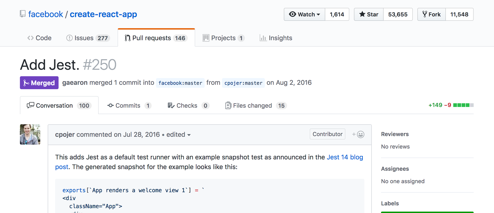
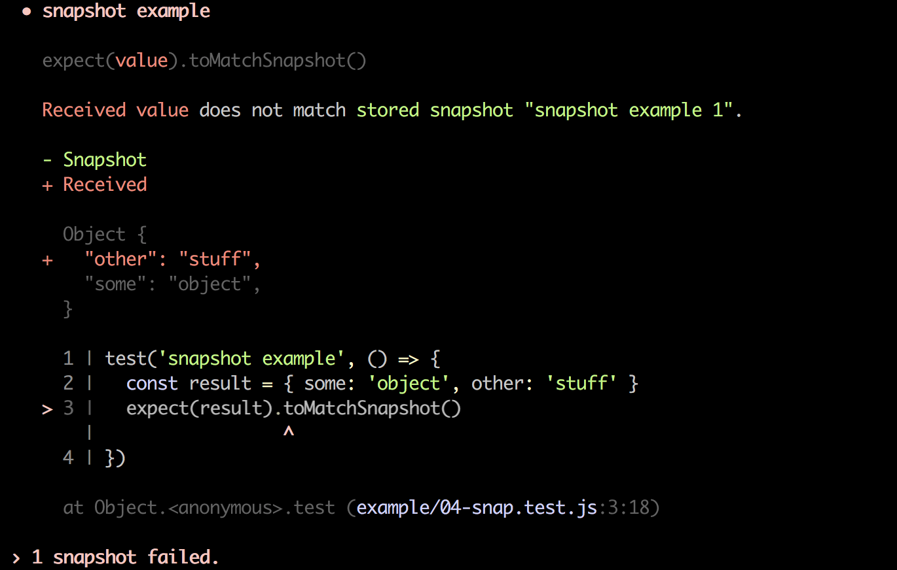

# Jest 🃏
## Co možná neznáte

Jan Vlnas, Tech Talks #7<br>13. 8. 2018

---

# Historie

---

## 2014


----


> Talking to other parts of the business who ‘failed to adopt’ Jest, they would tell us that it was a pain to set up, that it would crash silently in the background without alerting anyone and when they tried to actually use it, it required an older version of NodeJS. Whaat?

<small>[Painless JavaScript testing? Surely you Jest! (2015)](https://rea.tech/painless-javascript-testing-surely-you-jest/)</small>

---

## 2016

> …people working on Jest moved on to other projects within Facebook.
>
> As engineers added more and more tests though, we noticed the performance of Jest wasn't going to scale.

<small>[JavaScript Unit Testing Performance (2016)](https://jestjs.io/blog/2016/03/11/javascript-unit-testing-performance)</small>

----



---

## 2017


----

> Running our test suite with Mocha took 12+ minutes. In CI […] we’re now able to run the entire Jest suite in 4 minutes 30 seconds.

<small>[Migrating from Mocha to Jest](https://medium.com/airbnb-engineering/unlocking-test-performance-migrating-from-mocha-to-jest-2796c508ec50)</small>

---

# Proč Jest?

----

- Minimální konfigurace
  - Runner, assertions, mocking, snapshots <!-- .element: class="fragment" -->
- Rychlost <!-- .element: class="fragment" -->
- <!-- .element: class="fragment" --> [Přívětivost](https://itnext.io/reasons-to-love-jest-the-developer-experience-b00ec93df7bb)
- Zpětná vazba <!-- .element: class="fragment" -->

---

# Jak se používá

----

### Kam s testy

- Adresář: `__tests__`
- Soubory: `*.test.js(x)`

----

```js
// __tests__/sum.js
const {sum} = require('../sum')

describe('.sum', () => {
  test('adds 1 + 2 to equal 3', () => {
    expect(sum(1, 2)).toBe(3)
  })
})
```

----

```js
// __tests__/sum.js
const {sum} = require('../sum')

describe('.sum', () => {
  it('adds two numbers', () => {
    expect(sum(1, 2)).toBe(3)
  })
})
```

<small>[Better Specs: Don't use should](http://www.betterspecs.org/#should)</small>

---

## Parametrické testy

----

```js
// Array syntax
test.each([
  [1, 1, 2],
  [1, 2, 3],
  [2, 1, 3],
])(
  '.sum(%i, %i) => %i',
  (a, b, expected) => {
    expect(sum(a, b)).toBe(expected);
  },
)
```

----

```js
test.each`
  a    | b    | expected
  ${1} | ${1} | ${2}
  ${1} | ${2} | ${3}
  ${2} | ${1} | ${3}
`('returns $expected for sum($a, $b)', ({a, b, expected}) => {
  expect(sum(a, b)).toBe(expected);
})
```

---

## [Mockování funkcí](https://jestjs.io/docs/en/mock-functions)

----

### `jest.fn`

```js
const myMock = jest.fn()

myMock(1, 2)

expect(myMock).toHaveBeenCalled()
expect(myMock).toHaveBeenLastCalledWith(1, 2)
```

----

### `jest.spyOn`

```js
const nowSpy = jest.spyOn(Date, 'now')
Date.now()
expect(nowSpy).toHaveBeenCalled()
```

----

### Mockování času

```js
const mockedDate = Date.UTC(2018, 5, 1)
const nowSpy = jest.spyOn(Date, 'now')
  .mockImplementation(() => mockedDate)

// ...later
nowSpy.mockRestore()
```

---

## [Mockování modulů](https://jestjs.io/docs/en/manual-mocks)

----

```js
// modul.js

const randomNumber = require('random-number')

exports.randomIndex = () => {
  return 'someIndex-' + randomNumber()
}
```

```js
// modul.test.js

expect(randomIndex()).toBe('someIndex-4')
```

----

```
.
├── node_modules
│   └── random-number
├── __mocks__
│   └── random-number.js
└── src
    └── modul.js
```

----

```js
// __mocks__/random-number.js

module.exports = () => 4
```

---

### [`jest.mock`](https://jestjs.io/docs/en/jest-object#jestmockmodulename-factory-options)

- Standardní moduly <br> `jest.mock('fs')` <!-- .element: class="fragment" -->
- In-line definice mocku <!-- .element: class="fragment" -->

---

```js
jest.mock('../module-name', () => {
  return jest.fn(() => 42)
})

const moduleName = require('../module-name')
moduleName() // => 42
```

---

### Více mockování

- [Fake timers](https://jestjs.io/docs/en/timer-mocks) (`setTimeout`, `setInterval`…)
- [Automocking](https://jestjs.io/docs/en/configuration.html#automock-boolean)

---

## ⚠️

Jest automaticky nevyčistí volání mocků mezi testy.

- Explicitně: `jest.clearAllMocks()`
- [V nastavení](https://jestjs.io/docs/en/configuration.html#clearmocks-boolean): `clearMocks: true`

---

## [Immersive Watch Mode](http://facebook.github.io/jest/blog/2017/02/21/jest-19-immersive-watch-mode-test-platform-improvements.html)

----

```sh
npx jest --watch
```

----

[](https://asciinema.org/a/ndh9L1WBhfBPJCCbR3suyGfjs?size=medium) <!-- .element class="stretch" target="_blank" -->

---

## [Snapshot Testing](https://jestjs.io/docs/en/snapshot-testing.html)

----

```js
expect({some: 'object'}).toMatchSnapshot()
```

```js
// __snapshots__/test-filename.js.snap
exports[`snapshot example 1`] = `
Object {
  "some": "object",
}
`;
```
<!-- .element: class="fragment" -->

----

```js
expect({some: 'object'}).toMatchSnapshot()
```

```js
expect({some: 'object', other: 'stuff'}).toMatchSnapshot()
```

----



----

```sh
npx jest -u
```

```js
// __snapshots__/test-filename.js.snap
exports[`snapshot example 1`] = `
Object {
  "other": "stuff",
  "some": "object",
}
`;
```
---

### Snapshoty: Pro a proti

- 👍 Snadná údržba a rychlá iterace <!-- .element: class="fragment li-emoji" -->
- 👍 Testování legacy kódu <!-- .element: class="fragment li-emoji" -->
- 👎 Křehkost při velkých změnách <!-- .element: class="fragment li-emoji" -->
- 👎 Není zřejmé, co je důležité <!-- .element: class="fragment li-emoji" -->

----

Viz také

- [Gold Master Testing](https://codeclimate.com/blog/gold-master-testing/)
- [Guru Checks Output](http://wiki.c2.com/?GuruChecksOutput) (antipattern)

---

## Proč zvolit Jest?

- 🤩 Rychlost, pohodlí a přívětivost <!-- .element: class="fragment li-emoji" -->
- 😊 React <!-- .element: class="fragment li-emoji" -->
- 🙂 Preprocesory <!-- .element: class="fragment li-emoji" -->
- 😏 jest-codemods <!-- .element: class="fragment li-emoji " -->

---

## Proč nezvolit Jest?

- 🤨 Snapshoty <!-- .element: class="fragment li-emoji" -->
- 😕 Přizpůsobitelnost <!-- .element: class="fragment li-emoji" -->
- 😤 Integrační testy <!-- .element: class="fragment li-emoji" -->
- 🤯 Komplexita <!-- .element: class="fragment li-emoji" -->

---

[github.com/jnv/talk-jest](https://github.com/jnv/talk-jest)


<!--
## Snaphoty v Mocha / Chai

- https://github.com/bahmutov/snap-shot-it
- https://github.com/wellguimaraes/mocha-snapshots
- https://github.com/suchipi/chai-jest-snapshot
- https://github.com/marvinhagemeister/chai-snapshot-tests
-->