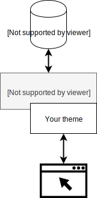
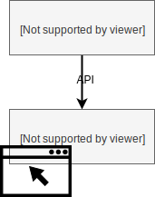
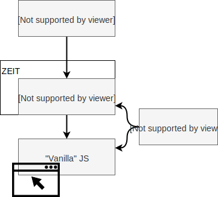

# Svelte & Sapper

Build a Website on a Headless CMS with Svelte

ReactiveConf Workshop<br>1. 11. 2019

---

## What we will do today?

[nerdcafe.now.sh](https://nerdcafe.now.sh/)

Note:
Let's check out what we will work towards today.
Most parts of this site are currently static, but the Offer section is editable with CMS.
What's the advantage of this approach?

---

## Battle Plan

1. Intro (👋 we are here)
1. Svelte Crash Course
1. Exploring Website Code + Tasks
1. Sapper + Tasks
1. Setting up CMS
1. Deployment to ZEIT
1. Your Turn

----

### What's Not Covered

- Testing
- Static site hosting
- Web Components & Custom Elements

---

## Architecture Overview

Traditional vs. Headless CMS

---


 <!-- .element: class="full-height" -->

Traditional (coupled) CMS

Note:
Let's do first a quick recap how we can approach website content management.
The traditional approach which Adam likes to pick on is to have coupled CMS. Your CMS of choice, like WordPress, provides you with both administration interface and theming capabilities.
This approach is very proven by time, but it has some drawbacks:
- your content is mostly tied to the theming,
- you need to learn PHP and CMS's specific API,
- CMS needs to be maintained to avoid security issues.
For smaller sites where only some content needs to be editable it's an overkill. If you need some static content which is designed and not easily editable, you either end up bending CMS editor or hacking the static content into the theme.

----

### Traditional (coupled) CMS

- Administration + front-end
- Server-side rendering
- JS sprinkled on top
- Content coupled with theming

---


### Headless CMS

- CMS provides administration + API
- Front-end pulls content from API
- Complete control over front-end

Note:
With decoupled or "headless" CMS approach, your interaction with CMS is limited to API. CMS provides you with content editor, but how you display the content to users is completely under your control.

---


 <!-- .element: class="full-height" -->

Headless CMS + Client-side Rendering

Note:
The easiest way how to take advantage of headless CMS is to roll some client-side JS application, which directly fetches data from API. You can use static hosting for that.
While this is great for prototyping and web applications, it's not great for _websites_, because users need to wait for JavaScript to load before they see the content. This also renders your site invisible for some search engines and browsers.

----

### Headless CMS + Client-side Rendering

- 👍 Easy static hosting <!-- .element: class="li-emoji" -->
- 👎 Bad for users and SEO <!-- .element: class="li-emoji" -->

---

 <!-- .element: class="full-height" -->

Headless CMS + Universal Rendering

Note:
So what we will do today is that we will combine client-side application with server-side rendering, this is also called "universal" or "isomorphic" rendering.
Your website will have server-side part which provides static HTML on first load and client-side part which takes over the rendering as user browses the website. This can be also leveraged to support offline capabilities.

----

### Headless CMS + Universal Rendering

- 👍 Better performance <!-- .element: class="li-emoji" -->
- 👎 You need a server component <!-- .element: class="li-emoji" -->

---

In Particular…

 <!-- .element: class="full-height" -->


----

### In Particular

- Prismic for headless CMS
- ZEIT for hosting
- Svelte for front-end components
- Sapper for server-side functionality

---

| UI Library | App Framework |
|------------|---------------|
| Svelte     | Sapper        |
| React      | Next.js       |
| Vue.js     | Nuxt.js       |

---

# Svelte Crash Course

---

## Why Svelte?

> The magical disappearing UI framework.

----

## Pros

- Single-file components<!-- .element: class="fragment" -->
- <!-- .element: class="fragment" -->
  Less boilerplate (same functionality in React can be [3 times bigger](https://svelte.dev/blog/write-less-code))
- Low runtime overhead<!-- .element: class="fragment" -->
- No virtual DOM<!-- .element: class="fragment" -->
- Built-in reactivity, two-way binding, state management<!-- .element: class="fragment" -->

Note:
- single-file components: very similar to Vue, but with even less boilerplate
- Svelte doesn't have runtime library like React or Vue which is responsible for the whole lifecycle of the application, instead components are compiled into "vanilla JS" where components have all required functionality built-in
- no virtual DOM: VDOM diffing is used to minimize updates to real DOM; Svelte finds out during compilation what parts of DOM can change and can "surgically" update only relevant parts of DOM
- reactivity and two-way binding is compiled in, so there's no overhead if you don't use these features

---

> Svelte is a language.
> Specifically, Svelte is an attempt to answer a question[…]:
> **what would it look like if we had a language for describing reactive user interfaces?**

[Rich Harris: The truth about Svelte](https://gist.github.com/Rich-Harris/0f910048478c2a6505d1c32185b61934)

Note:
See also Elm

---

## How does it look?

The Hello World component

----

```html
<script>
	let name = 'world';
</script>

<style>
	h1 {
		color: purple;
		font-family: 'Comic Sans MS';
		font-size: 2em;
	}
</style>

<h1>Hello {name}!</h1>
```

[Repl](https://svelte.dev/repl/c9123a9cb8654ebfbd800faa7c1e45fc)

Note:
Take a look at:
- generated JS (note `svelte/internal`)
- scoped styles

----

### Component With Props

----

```html
<script>
	export let name = 'World';
</script>
```

```html
<Hello name="ReactiveConf" />
```

[Repl](https://svelte.dev/repl/f3b3e4d874ee4cb683cd91ee17a3ca68?version=3.12.1)

---

### Slots (aka Child Components)

----

```html
<!-- Box.svelte -->
<div class="box">
	<slot></slot>
</div>
```

```html
<!-- App.svelte -->
<Box>
	<p>This goes to slot!</p>
</Box>
```

[Repl](https://svelte.dev/repl/e2a2a1875fcf4338865fc9cef39f70d6?version=3.12.1)

---

## Your Turn!

1. Go to **[is.gd/sapperws](https://is.gd/sapperws)**
1. Fork it (optionally)
1. Clone it
1. `npm i`
1. `npm run dev`

----

## Take a look around

- `src/routes/index.svelte` (`/`)
- `src/routes/about.svelte` (`/about`)
- `src/routes/_layout.svelte`
- `src/components`

---

## Tasks

Use The Docs: [svelte.dev](https://svelte.dev/)

----

### Fix `HeroBanner`

----

### Display all icons in `SocialMedia`

_Use `{#each}`_

[Repl](https://svelte.dev/repl/49395cb154fa49a09ec92daa50d56ae3?version=3.12.1)

----

### Fix "Find More" on About page

_Reactivity!_ ⚛️

[Repl](https://svelte.dev/repl/22109b3a46404727a9207411ae83d705?version=3.12.1)

---

## Svelte Cons?

- Pretty new (2016)<!-- .element: class="fragment" -->
- Requires build step<!-- .element: class="fragment" -->
- Lack of tooling<!-- .element: class="fragment" -->
- Doesn't get rid of JS<!-- .element: class="fragment" -->

---

# Sapper

> The next small thing in web development

---

## Project Structure

```text
├ package.json
├ src
│ ├ components
│ ├ routes
│ │ ├ # your routes here
│ │ ├ _error.svelte
│ │ └ index.svelte
│ ├ client.js
│ ├ server.js
│ ├ service-worker.js
│ └ template.html
├ static
│ ├ # your files here
└ rollup.config.js / webpack.config.js
```

Note:
- src: 3 entry points: `src/client.js`, `src/server.js` and (optionally) `src/service-worker.js`
  - client.js: Boots up client-side application
  - server.js: HTTP server, e.g. Express or Polka
  - template.html: HTML for responses from server

---

### Routing

---

#### Static Route

`src/routes/about.svelte` → `/about`

```html
<svelte:head>
	<title>About</title>
</svelte:head>

<h1>About this site</h1>
<p>Some about text here.</p>
```

---

#### Dynamic Route

- `/blog/my-blogpost-title`
- <!-- .element: class="fragment" -->
  `/blog/:slug`
- <!-- .element: class="fragment" -->
  `src/routes/blog/[slug].svelte`


---

#### Client-side Part

```html
<!-- src/routes/blog/[slug].svelte -->
<script context="module">
	export async function preload(page, session) {
		const { slug } = page.params;

		const res = await this.fetch(`blog/${slug}.json`);
		const article = await res.json();

		return { article };
	}
</script>

<script>
	export let article;
</script>

<h1>{article.title}</h1>
<div class="content">
	{@html article.content}
</div>
```

---

#### Server-side Part

```js
// routes/blog/[slug].json.js
export async function get(req, res, next) {
	const { slug } = req.params;

	// Somehow fetch the article
	const article = await db.get(slug);

	if (article !== null) {
		res.setHeader('Content-Type', 'application/json');
		res.end(JSON.stringify(article));
	} else {
		next();
	}
}
```

---

#### File Naming Rules 1/2

- `src/routes/index.svelte` → `/`
-  `src/routes/about.svelte` → `/about`
- `src/routes/blog/index.svelte` → `/blog`

&hellip;

----

&hellip;

- `src/routes/_anything.svelte` → Nothing
- `src/routes/_helpers/anything.svelte` → Nothing
- `src/routes/blog/[slug].svelte` → `/blog/some-url-slug`
- `src/routes/blog/[slug].json.js` → `/blog/some-url-slug.json` (server route)
---

## Task: Display full menu on offer page!

- Use `src/cms.js` module
- You will need to process the data from CMS

---

# Bring Your Own Content

[prismic.io](https://prismic.io/)

----

## Task: Setup CMS for our project

- Setup custom types: `cms/types`
- Add some content
- Change `BASE_URL` in `cms.js`

---

# Deploy to ZEIT

[zeit.co](https://zeit.co/)

----

```console
now deploy
```

---

## Building & Exporting

Commands:

- <!-- .element: class="fragment" -->
  `sapper build` → `__sapper__/build`
- <!-- .element: class="fragment" -->
  `sapper export` → `__sapper__/export`


---

# Your Turn!

---

## Ideas

- Analytics<!-- .element: class="fragment" -->
- Individual page for each menu item<!-- .element: class="fragment" -->
- Image carousel driven by CMS<!-- .element: class="fragment" -->
- Editable content on home page<!-- .element: class="fragment" -->
- Static hosting with Netlify<!-- .element: class="fragment" -->


----

## Further Ideas

- Booking: send e-mail upon form submission
- Offline Support, data update with service worker
- Better page transitions
- Data fetching with GraphQL
