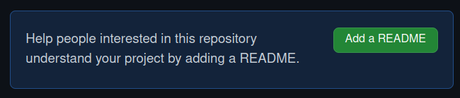
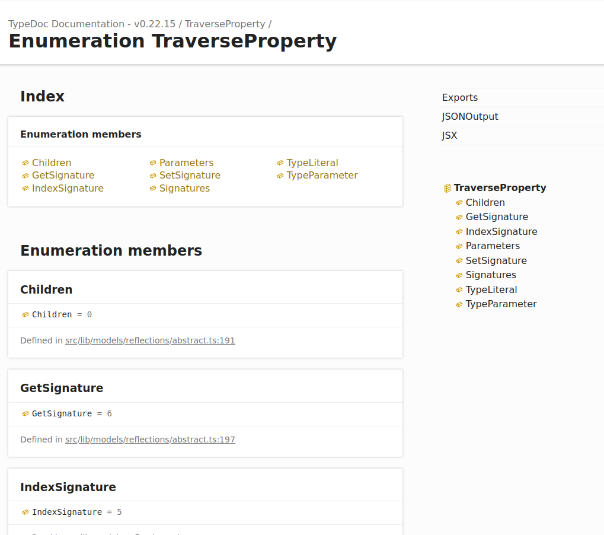
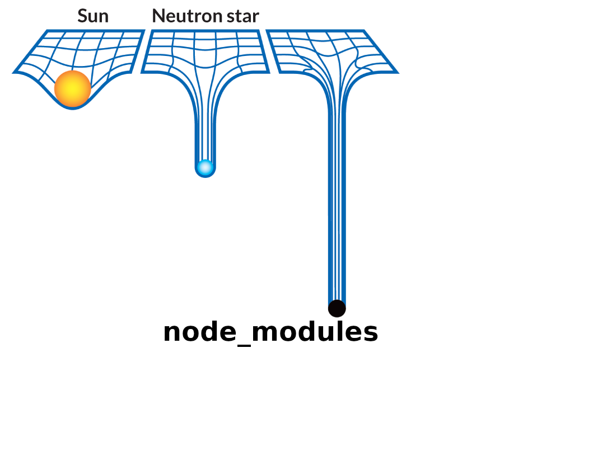
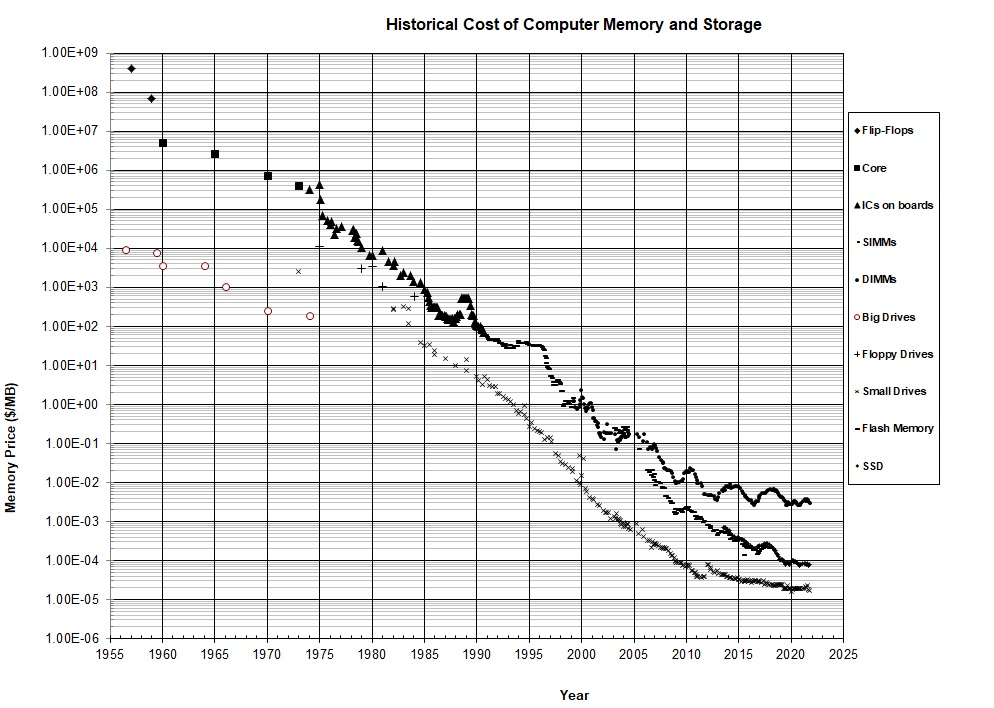
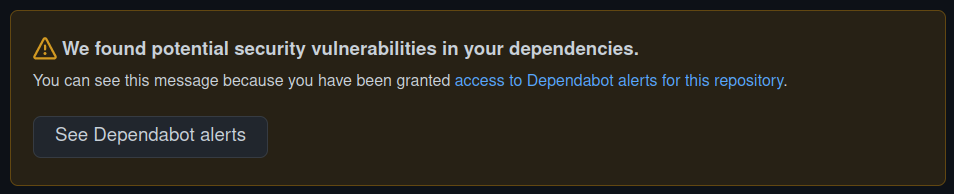
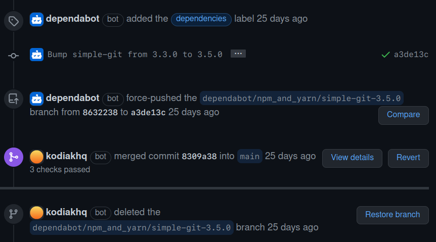
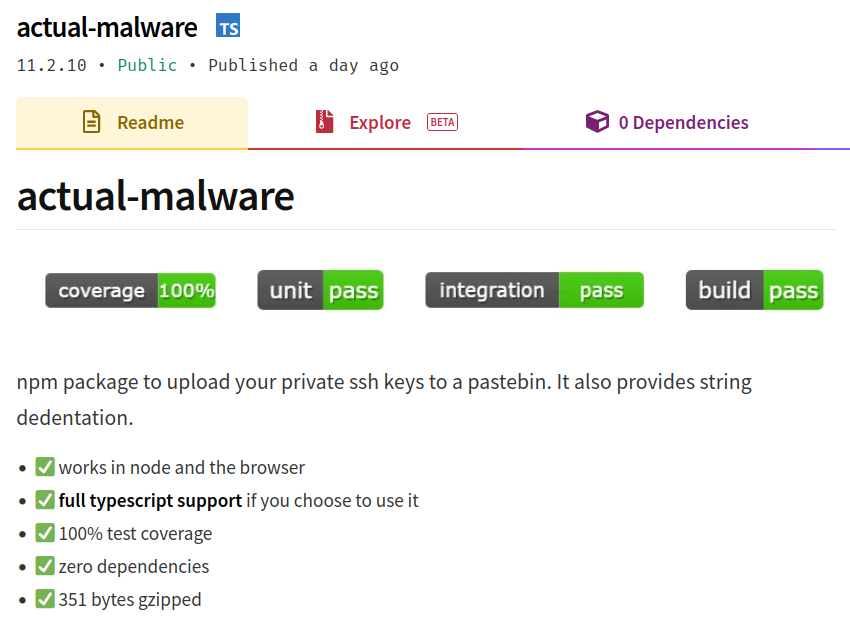

## How to lose users &amp; alienate&nbsp;developers

PragueJS, April 2022

---


---

## Developers<br>=<br>Users

---

## Developer Experience<br>=<br>User Experience

---

## Documentation<br><span style="text-transform: none;">APIs</span><br>Packages

---

vidbg: https://giphy.com/gifs/g-help-11Wkoq2MaUbLXi

---

## How to win users &amp; make developers happy

---

vidbg: https://media.giphy.com/media/tmQrpA8zpG4a16SSxm/giphy.gif

---

<section data-auto-animate>
<h2>How to lose users &amp; alienate&nbsp;developers</h2>
Jan Vlnas, Dev<span style="visibility: hidden">il's</span> Advocate<span style="visibility: hidden"> 😈</span>
</section>
<section data-auto-animate>
<h2>How to lose users &amp; alienate&nbsp;developers</h2>
Jan Vlnas, Dev<span>il's</span> Advocate<span> 😈</span>
</section>

---

## Why? <!-- .element: class="r-fit-text" -->

---

- Open-source = portfolio 👍
- People may use it 🤷 <!-- .element: class="fragment" -->
- Users demand fixes 😫 <!-- .element: class="fragment" -->
- Users demand features 😡 <!-- .element: class="fragment" -->

---

## Goals <!-- .element: class="r-fit-text" -->

---

vidbg: https://media.giphy.com/media/11bsDL7acBaiKk/giphy.gif

---

vidbg: https://media.giphy.com/media/clnjwheMYqCpDBsDiW/giphy.gif

---

<!-- only for true users -->

vidbg: https://giphy.com/gifs/angry-spongebob-squarepants-strong-D7z8JfNANqahW

---

- Docs
- Interfaces
- Packages

---

## Docs <!-- .element: class="r-fit-text" -->

---



---

vidbg: https://media.giphy.com/media/3DzwbT4oF52JG/giphy.gif

---

## Do this ✅

- fancy words
- jargon
- emphasize simplicity

---

“revolutionary”

“sophisticated”

“unparalleled”

---

“DLTs promise to revolutionize business ecosystems by permitting secure transactions without intermediaries.”

<!-- https://github.com/DLPS-Framework/DAppFormation -->

---

<section data-auto-animate>
“<span>[redacted]</span> is a universal API client which provides an unparalleled developer experience for every HTTP&nbsp;API.”
</section>
<section data-auto-animate>
“<strong>OneSDK</strong> is a universal API client which provides an unparalleled developer experience for every HTTP&nbsp;API.”
</section>

---

<!-- elementary my dear -->

vidbg: https://media.giphy.com/media/3oEjHD20zWeDvGWoF2/giphy.gif

---

“Just simply install FooBar”

---

“Just one simple SDK for all the APIs you want to integrate with.”

---

<div style="display: flex; align-items: center;">

 <!-- .element: class="fragment" -->

Examples without reference

</div>

---

<div style="display: flex; align-items: center;">


Reference without examples

</div>

---



---

## Interfaces <!-- .element: class="r-fit-text" -->

---

## Do this ✅

- avoid consistency
- expose complexity

---

<pre><code data-line-numbers="|2-4|7-8|9-15">{
  "page_count": 1,
  "page_size": 25,
  "total_items": 3,
  "bookings": [
    {
      "arrivalDate": "2022-11-01",
      "departureDate": "2022-12-03",
      "reference-id": null,
      "created-at": "2020-01-03 13:51",
      "guest-name": "Harry Potter",
      "check-in": "16:00",
      "check-out": "10:00",
      "price-paid": "Yes",
      "prepayment-paid": "No"
    }
  ]
}
</code></pre>

---

✅ camelCase

✅ snake_case

✅ kebab-case

---

> If the domain is hard, users should feel the pain.

---

vidbg: https://media.giphy.com/media/saAZVlxwMPOW4/giphy.gif

---

<section data-auto-animate>
/v2/organizationAcls?q=roleAssignee&state=APPROVED&role=ADMINISTRATOR&count=100projection=(paging,elements(*(organization~(id,localizedName,vanityName,&hairsp;logoV2(cropped~:playableStreams)))))
</section>

<section data-auto-animate>
<strong>api.linkedin.com</strong>
/v2/organizationAcls?q=roleAssignee&state=APPROVED&role=ADMINISTRATOR&count=100&projection=(paging,elements(*(organization~(id,localizedName,vanityName,&hairsp;logoV2(cropped~:playableStreams)))))
</section>

---

```json
{
  "specificContent": {
    "com.linkedin.ugc.ShareContent": {
      "shareMediaCategory": "LIVE_VIDEO",
      "shareCommentary": {
        "attributes": [],
        "text": ""
      },
      "media": [
        {
          "media~": {
            "paging": {
              "count": 10,
              "start": 0,
              "links": []
            },
            "elements": [
              {
                "artifact": "urn:li:digitalmediaMediaArtifact:(urn:li:digitalmediaAsset:C4D24AQGPmrEiJ7bLXw,urn:li:digitalmediaMediaArtifactClass:feedshare-live-vod-ambry-analysis)",
                "authorizationMethod": "PUBLIC",
                "data": {
                  "com.linkedin.digitalmedia.mediaartifact.Video": {
                    "videoStreams": []
                  }
                }
              }
            ]
          }
        }
      ]
    }
  }
}
```

---

## Packages <!-- .element: class="r-fit-text" -->

---

## Do this ✅

- embrace dependencies
- make a statement
- get rich and (in)famous

---

## DRY <!-- .element: class="r-fit-text" -->

---

<!-- .slide: data-background="#fff" -->



---

<!-- .slide: data-background="#fff" -->


---

<!-- .slide: data-background="#fff" -->



<small>[Disk Drive Storage Price Decreasing with Time](https://jcmit.net/disk2015.htm) (October, 2021)</small>

---

&lt; $&nbsp;0.01 <!-- .element: class="r-fit-text" -->

per megabyte

---

> Unused RAM is wasted RAM.

---



---



---

vidbg: https://media.giphy.com/media/V4NSR1NG2p0KeJJyr5/giphy.gif

---

## Make a

## statement<!-- .element: class="r-fit-text" -->

---

```js
function foo(str, len, ch) {
  str = String(str);
  var i = -1;
  if (!ch && ch !== 0) ch = " ";
  len = len - str.length;
  while (++i < len) {
    str = ch + str;
  }
  return str;
}
```

---

```js
module.exports = leftpad;
function leftpad(str, len, ch) {
  str = String(str);
  var i = -1;
  if (!ch && ch !== 0) ch = " ";
  len = len - str.length;
  while (++i < len) {
    str = ch + str;
  }
  return str;
}
```

---

> Summary; NPM is no longer a place that I’ll share my open source work at, so, **I’ve just unpublished all my modules**.
>
> — Azer Koçulu: [I’ve Just Liberated My Modules](https://web.archive.org/web/20160606121146/https://medium.com/@azerbike/i-ve-just-liberated-my-modules-9045c06be67c)

---

<div style="display: flex; align-items: center; justify-content: space-around">


left-pad

</div>

---

<div style="display: flex; align-items: center; justify-content: space-around">


uWebSockets.js

</div>

---

> uWS’s author, in some kind of childish act of vengeance, tried to break dependent libraries and services by **publishing an empty version of the module**…
> the team behind NPM manually removed it and locked the package
>
> — Manuel Astudillo, [Beware of uWebsockets.js!](https://medium.com/@rockstudillo/beware-of-uwebsockets-js-b51c92cac83f)

---

<div style="display: flex; align-items: center; justify-content: space-around">


Protestware

</div>

---

> the malicious code, committed […] by the dev, would read the system's external IP address and **only delete data by overwriting files for users based in Russia and Belarus.**
>
> ­— [BIG sabotage: Famous npm package deletes files to protest Ukraine war](https://www.bleepingcomputer.com/news/security/big-sabotage-famous-npm-package-deletes-files-to-protest-ukraine-war/)

---

- colors &amp; faker
- node-ipc
- event-source-polyfill

---

vidbg: https://media.giphy.com/media/l2Sq9qGTQnL5NyI6Y/giphy.gif

---

## event-stream

- popular, but abandoned package ✅ <!-- .element: class="fragment" -->
- new volunteer maintainer ✅ <!-- .element: class="fragment" -->
- new, innocent subdependency ✅ <!-- .element: class="fragment" -->
- injection into published, minifed code ✅ <!-- .element: class="fragment" -->

<small>[A post-mortem of the malicious event-stream backdoor](https://snyk.io/blog/a-post-mortem-of-the-malicious-event-stream-backdoor/) <!-- .element: class="fragment" --><small>

---

### Inspiration



---

<div style="display: flex; align-items: center;">


Stealing

</div>

<div class="fragment" style="display: flex; align-items: center;">


Surprise open-source sponsorship

</div>

---

# How do <u>you</u> alienate developers?

---

/s <!-- .element: class="r-fit-text" -->

---

[@janvlnas](https://twitter.com/janvlnas)

[jan.vlnas.cz](https://jan.vlnas.cz/)

[superface.ai](https://superface.ai/)
