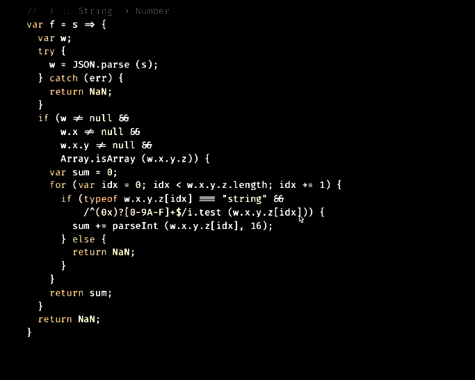

## Programming Safely in an Uncertain World
### David Chambers

ReactiveConf Summary 2018<br>Tech Talks #10, 19. 2. 2019

---

- 10KB or Bust: The Delicate Power of Webpack and Babel
- Delightful UI animations by understanding the brain
- Programming Safely in an Uncertain World
- Reactive State Machines and Statecharts
- End-to-end testing is hard - but it doesn't have to&nbsp;be
- State management beyond the libraries

---

`TypeError: Cannot read property of undefined`

---

> Algebraic data types such as Maybe, Either, and Future allow us to deal with uncertainty in a principled, unified manner: no more conditional logic; no more exceptions.
>
> Instead, we get simple building blocks that snap together.

---

## Sanctuary

[sanctuary.js.org](https://sanctuary.js.org/)

---

```js
const S = require ('sanctuary')

S.parseInt
// parseInt :: Radix -> String -> Maybe Integer
```

```js
S.parseInt (16) ('0xFFFF')
// Just (65535)
```
<!-- .element: class="fragment" -->


```js
S.parseInt (16) ('Prague')
// Nothing
```
<!-- .element: class="fragment" -->


---

```js
S.parseInt(16, '0xFFFF')
```

```txt
TypeError: ‘parseInt’ applied to the wrong number of arguments

parseInt :: Radix -> String -> Maybe Integer
            ^^^^^
              1
```
<!-- .element: class="fragment" -->

---

```js
const parseHex = S.parseInt(16)
parseHex('0xFF')
// Just (255)
```

---

## Maybe

The Maybe type represents optional values: a value of type `Maybe a` is either `Nothing` (the empty value) or a `Just` whose value is of type `a`.

---

```js
S.head ([])
// Nothing
```

```js
S.head ([1, 2, 3])
// Just (1)
```
<!-- .element: class="fragment" -->


---

```js
S.map (S.sub(1)) ([1, 2, 3])
// [ 0, 1, 2 ]
```

```js
S.map (S.sub(1)) (S.Just (100))
// Just (99)
```
<!-- .element: class="fragment" -->

```js
S.map (S.sub(1)) (S.Nothing)
// Nothing
```
<!-- .element: class="fragment" -->

---

## Function Composition

> Function composition **limits complexity**, and is central to the Sanctuary experience

---

```js
S.pipe ([
    S.words,
    S.map (S.prop ('length')),
    S.map (Math.sqrt),
    S.sum,
]) ('I love Sanctuary')
// 6
```

---

## Type Checking

---

```js
S.parseJson
// parseJson :: (Any -> Boolean) -> String -> Maybe a
```

```js
S.parseJson (_ => true) ('[1,2')
// Nothing
```
<!-- .element: class="fragment" -->


```js
S.parseJson (_ => true) ('[1,2,3]')
// Just ([1, 2, 3])
```
<!-- .element: class="fragment" -->

---

```js
const $ = require ('sanctuary-def')
S.is ($.Array ($.Integer)) ([12, 34])
// true
```

```js
S.parseJson (S.is ($.Array ($.Integer))) ('[1,2,3]')
// Just ([1, 2, 3])
```
<!-- .element: class="fragment" -->

```js
S.parseJson (S.is ($.Array ($.Integer))) ('["1","2"]')
// Nothing
```
<!-- .element: class="fragment" -->

---

```json
{"x":{"y":{"z":["28","29","2A"]}}}
```

1. Parse JSON
2. Get array from `x.y.z`
3. Parse integers
4. Sum

---

```js
const f = s =>
    JSON.parse(s).x.y.z.reduce(
        (n, s) => n + parseInt(s, 16),
        0
    )
```

---

```js
S.pipe ([
    S.parseJson (_ => true),
    S.chain (S.gets (_ => true) (['x', 'y', 'z'])),
]) ('{"x":{"y":{"z":["28","29","2A"]}}}')
// Just (["28", "29", "2A"])
```

<small>[`chain` docs](https://sanctuary.js.org/#chain)</small>

---

```js
S.pipe ([
    S.parseJson (_ => true),
    S.chain (S.gets (_ => true) (['x', 'y', 'z'])),
    S.map (S.map (S.parseInt (16))),
]) ('{"x":{"y":{"z":["28","29","2A"]}}}')
// Just ([Just (40), Just (41), Just (42)])
```

---

```js
S.pipe ([
    S.parseJson (_ => true),
    S.chain (S.gets (_ => true) (['x', 'y', 'z'])),
    S.map (S.map (S.parseInt (16))),
    S.chain (S.sequence (S.Maybe)),
]) ('{"x":{"y":{"z":["28","29","2A"]}}}')
// Just ([40, 41, 42])
```

<small>[`sequence` docs](https://sanctuary.js.org/#sequence)</small>

---

```js
S.pipe ([
    S.parseJson (_ => true),
    S.chain (S.gets (_ => true) (['x', 'y', 'z'])),
    S.map (S.map (S.parseInt (16))),
    S.chain (S.sequence (S.Maybe)),
    S.map (S.sum),
]) ('{"x":{"y":{"z":["28","29","2A"]}}}')
// Just (123)
```

---

```js
S.pipe ([
    S.parseJson (_ => true),
    S.chain (S.gets (S.is ($.Array ($.String)))
                    (['x', 'y', 'z'])),
    S.map (S.map (S.parseInt (16))),
    S.chain (S.sequence (S.Maybe)),
    S.map (S.sum),
]) ('{"x":{"y":{"z":["28","29","2A"]}}}')
// Just (123)
```
---

- No IFs
- 100% branch coverage <!-- .element: class="fragment" -->

---



---

Sanctuary<br>&times;<br>Ramda

---

> Ramda provides several functions which return problematic values such as `undefined`, `Infinity`, or `NaN` when applied to unsuitable inputs.

> Every Sanctuary function is defined for every value which is a member of the function's input type. Such functions are known as total functions.
<!-- .element: class="fragment" -->

---

```js
if (R.isEmpty (xs)) {
  // ...
} else {
  return f (R.head (xs));
}
```

---

# 😕

---

- Haskell / ML style
  - <!-- .element: class="fragment" --> See also [Folktale](https://folktale.origamitower.com/)
- <!-- .element: class="fragment" --> [Maybe Not](https://www.youtube.com/watch?v=YR5WdGrpoug)?
- TypeScript / Flow <!-- .element: class="fragment" -->
- <!-- .element: class="fragment" --> [Small Functions Considered Harmful](https://medium.com/@copyconstruct/small-functions-considered-harmful-91035d316c29)?

---

## References

- [ReactiveConf 2018 Talk](https://www.youtube.com/watch?v=a2astdDbOjk)
  - Also LambdaConf: Part [1](https://www.youtube.com/watch?v=4WiNwODrYGI), [2](https://www.youtube.com/watch?v=N1LsbfHpMRI), [3](https://www.youtube.com/watch?v=3OwijRsWO4w)
- [Interview with D. Chambers](https://survivejs.com/blog/sanctuary-interview/)
- [Functional Geekery ep. 31](https://www.functionalgeekery.com/episode-31-david-chambers/)
- [Broken Promises – The unspoken flaws of JavaScript Promises](https://medium.com/@avaq/broken-promises-2ae92780f33)