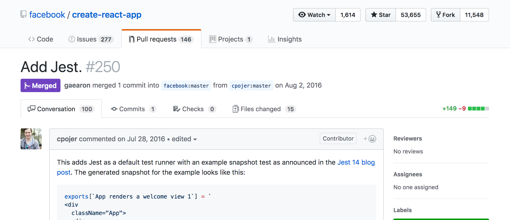
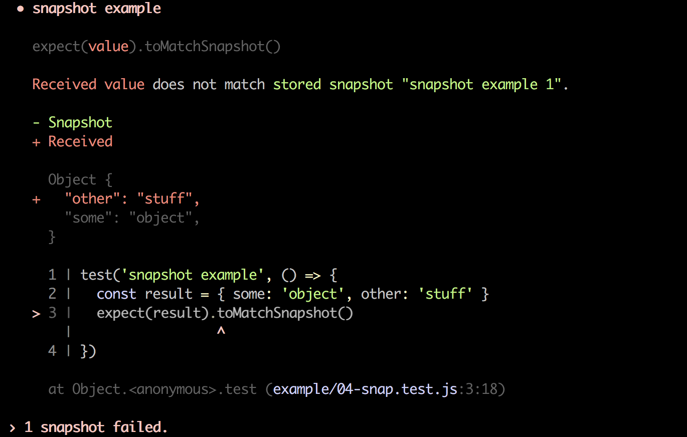

# Jest 🃏
## Co možná neznáte

Jan Vlnas, Tech Talks #7<br>13. 8. 2018

---

# Historie

---

## 2014


----


> Talking to other parts of the business who ‘failed to adopt’ Jest, they would tell us that it was a pain to set up, that it would crash silently in the background without alerting anyone and when they tried to actually use it, it required an older version of NodeJS. Whaat?

<small>[Painless JavaScript testing? Surely you Jest! (2015)](https://rea.tech/painless-javascript-testing-surely-you-jest/)</small>

---

## 2016

> ...people working on Jest moved on to other projects within Facebook.
>
> As engineers added more and more tests though, we noticed the performance of Jest wasn't going to scale.

<small>[JavaScript Unit Testing Performance (2016)](https://jestjs.io/blog/2016/03/11/javascript-unit-testing-performance)</small>

----



---

## 2017


----

> Running our test suite with Mocha took 12+ minutes. In CI [...] we’re now able to run the entire Jest suite in 4 minutes 30 seconds.

<small>[Migrating from Mocha to Jest](https://medium.com/airbnb-engineering/unlocking-test-performance-migrating-from-mocha-to-jest-2796c508ec50)</small>

---

# Proč Jest?

----

- Minimální konfigurace
  - Runner, assertions, mocking, snapshots <!-- .element: class="fragment" -->
- Rychlost <!-- .element: class="fragment" -->
- Zpětná vazba <!-- .element: class="fragment" -->

---

# Jak se používá

----

### Kam s testy

- Adresář: `__tests__`
- Soubory: `*.test.js(x)`

----

```js
// __tests__/sum.js
const {sum} = require('../sum')

describe('.sum', () => {
  test('adds 1 + 2 to equal 3', () => {
    expect(sum(1, 2)).toBe(3)
  })
})
```

----

```js
// __tests__/sum.js
const {sum} = require('../sum')

describe('.sum', () => {
  it('adds two numbers', () => {
    expect(sum(1, 2)).toBe(3)
  })
})
```

---

## Parametrické testy

----

```js
// Array syntax
test.each([
  [1, 1, 2],
  [1, 2, 3],
  [2, 1, 3],
])(
  '.sum(%i, %i) => %i',
  (a, b, expected) => {
    expect(sum(a, b)).toBe(expected);
  },
)
```

----

```js
test.each`
  a    | b    | expected
  ${1} | ${1} | ${2}
  ${1} | ${2} | ${3}
  ${2} | ${1} | ${3}
`('returns $expected for sum($a, $b)', ({a, b, expected}) => {
  expect(sum(a, b)).toBe(expected);
})
```

---

## Mockování funkcí

<small>https://jestjs.io/docs/en/mock-functions</small>

----

### `jest.fn`

```js
const myMock = jest.fn()

myMock(1, 2)

expect(myMock).toHaveBeenCalled()
expect(myMock).toHaveBeenLastCalledWith(1, 2)
```

----

### `jest.spyOn`

```js
const nowSpy = jest.spyOn(Date, 'now')
Date.now()
expect(nowSpy).toHaveBeenCalled()
```

----

### Mockování času

```js
const mockedDate = Date.UTC(2018, 5, 1)
const nowSpy = jest.spyOn(Date, 'now')
  .mockImplementation(() => mockedDate)

// ...later
nowSpy.mockRestore()
```

---

## Mockování modulů

<small>https://jestjs.io/docs/en/manual-mocks</small>

----

```js
// modul.js

const randomNumber = require('random-number')

exports.randomIndex = () => {
  return `someIndex-${randomNumber()}`
}
```

```js
// modul.test.js

expect(randomIndex()).toBe('someIndex-4')
```

----

```
.
├── node_modules
│   └── random-number
├── __mocks__
│   └── random-number.js
└── src
    └── modul.js
```

----

```js
// __mocks__/random-number.js

module.exports = () => 4
```

---

### [`jest.mock`](https://jestjs.io/docs/en/jest-object#jestmockmodulename-factory-options)

- Standardní moduly <br> `jest.mock('path')` <!-- .element: class="fragment" -->
- In-line definice mocku <!-- .element: class="fragment" -->

---

```js
jest.mock('../moduleName', () => {
  return jest.fn(() => 42)
})

const moduleName = require('../moduleName')
moduleName()
```

----

## ⚠️

Jest automaticky nevyčistí volání mocků mezi testy.

- Explicitně: `jest.clearAllMocks()`
- [V nastavení](https://jestjs.io/docs/en/configuration.html#clearmocks-boolean): `clearMocks: true`

---

## [Immersive Watch Mode](http://facebook.github.io/jest/blog/2017/02/21/jest-19-immersive-watch-mode-test-platform-improvements.html)

----

```sh
npx jest --watch
```

----

[](https://asciinema.org/a/ndh9L1WBhfBPJCCbR3suyGfjs?size=medium) <!-- .element class="stretch" target="_blank" -->

---

## [Snapshot Testing](https://jestjs.io/docs/en/snapshot-testing.html)

----

```js
expect({some: 'object'}).toMatchSnapshot()
```

```js
// __snapshots__/test-filename.js.snap
exports[`snapshot example 1`] = `
Object {
  "some": "object",
}
`;
```
<!-- .element: class="fragment" -->

----

```js
expect({some: 'object'}).toMatchSnapshot()
```

```js
expect({some: 'object', other: 'stuff'}).toMatchSnapshot()
```

----



----

```sh
npx jest -u
```

```js
// __snapshots__/test-filename.js.snap
exports[`snapshot example 1`] = `
Object {
  "other": "stuff",
  "some": "object",
}
`;
```
---

### Snapshoty: Pro a proti

- 👍 Snadná údržba a rychlá iterace <!-- .element: class="fragment" -->
- 👍 Testování legacy kódu <!-- .element: class="fragment" -->
- 👎 Křehkost při velkých změnách <!-- .element: class="fragment" -->
- 👎 Není zřejmé, co je důležité <!-- .element: class="fragment" -->

----

- [Gold Master Testing](https://codeclimate.com/blog/gold-master-testing/)
- [Guru Checks Output](http://wiki.c2.com/?GuruChecksOutput) (antipattern)

---

## Proč zvolit Jest?

- 🤩 Rychlost a pohodlí <!-- .element: class="fragment" -->
- 😊 React <!-- .element: class="fragment" -->
- 🙂 Preprocesory <!-- .element: class="fragment" -->
- 😏 jest-codemods <!-- .element: class="fragment" -->

---

## Proč nezvolit Jest?

- 🤨 Snapshoty <!-- .element: class="fragment" -->
- 😕 Přizpůsobitelnost <!-- .element: class="fragment" -->
- 😤 Integrační testy <!-- .element: class="fragment" -->
- 🤯 Komplexita <!-- .element: class="fragment" -->

---

<!--
## Snaphoty v Mocha / Chai

- https://github.com/bahmutov/snap-shot-it
- https://github.com/wellguimaraes/mocha-snapshots
- https://github.com/suchipi/chai-jest-snapshot
- https://github.com/marvinhagemeister/chai-snapshot-tests
-->